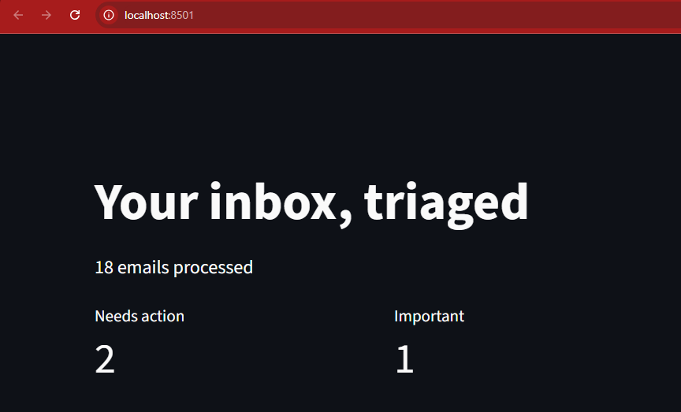

# Email Intelligence (manual run)

Fetches recent Gmail, analyzes it with Gemini, stores results in SQLite, shows
a triaged dashboard. No scheduling, no auto-send. Rerun `process.py` any time
to pick up new mail, it skips emails already in the database.

## What it does

1. `process.py` fetches emails from the last 2 days (excluding Promotions and
   Social), sends them to Gemini in one batched call for category, priority,
   whether they need action, any deadline, a summary, and a suggested next
   step, and stores the results in `emails.db`.
2. `app_email.py` shows it as a dashboard: Needs action / Important / Low
   priority, filterable by category, with a link to open each email and a
   checkbox to mark it attended.
3. `run.py` (or `start.bat` on Windows) runs both in sequence.
```
Gmail API
    │
    ▼
process.py
    │
    ├── Fetch & filter emails
    ├── Send to Gemini
    └── Store analysis
    │
    ▼
SQLite (emails.db)
    │
    ▼
app_email.py
    │
    ▼
Streamlit Dashboard
```
## Setup

### 1. Gmail API access

- Create a project at https://console.cloud.google.com and enable the **Gmail API**
- Credentials → Create Credentials → OAuth client ID → **Desktop app** → download as `credentials.json` in this folder
- Under OAuth consent screen, fill in the required fields and add your own Gmail as a **test user**, otherwise Google blocks the request before you even see a login screen

### 2. Gemini API key

Get one at https://ai.google.dev

### 3. Install and configure

```bash
pip install -r requirements_email.txt
```

Create a `.env` file in this folder:

```
GEMINI_API_KEY=your_key_here
```

## Run

```bash
python run.py
```
On Windows, you can also double-click start.bat.

Or run the steps separately:
(or `python process.py` then `streamlit run app_email.py` )

First run opens a browser to grant read-only Gmail access and saves a
`token.json` so you won't have to re-auth each time.

## Notes

- **Scope**: last 2 days, edit `QUERY` in `process.py` to widen it.
- **Batched analysis**: all new emails go into one Gemini call to save on
  requests. Trade-off, if the response gets truncated or Gemini drops an
  email from its output, that email just doesn't get stored, no error, and
  it'll get retried automatically next run since it's never marked processed.
  Fine at low volume; if you widen the date range and this becomes a
  problem, split `analyze_emails` into chunks of ~10-15 emails per call.
- **Deadlines**: stored as both the exact phrase from the email and a
  best-effort parsed date, so you can sanity-check rather than trust the
  parse blindly. The model is told not to invent deadlines or actions.
- **Read-only**: Gmail scope is `gmail.readonly`. Nothing is ever sent or
  modified in your inbox, the dashboard only recommends and lets you mark
  things attended locally.
  
[](https://youtube.com/shorts/pMEWuHDCAVE?feature=share)
